# #boraCodar

    Projetos #boraCodar da Rocketseat  
    <a href="https://boracodar.dev">Acesse o desafio desta semana clicando aqui</a> 
     <table>
    <thead>
        <tr>
            <th align="center">
                 
                

                    <small>#</small>
                

            </th>
            <th align="center">
                 
                
 
                    <small>
                        NAME
                    </small>
                

            </th>
            <th align="left">
                
                
 
                    <small>
                    RELEASE DATE
                    </small>
                

            </th>
            <th align="center">
                
                
 
                    <small>
                    PREVIEW
                    </small>
                

            </th>
        </tr>
    </thead>
    <tbody>
        <tr>
            <td>01</td>
            <td><a href="01">Player de Música</a></td>
            <td>11/01/23</td>
            <td align="center">
            </td>
        </tr>
        <tr>
            <td>02</td>
            <td><a href="02">Card de Produto</a></td>
            <td>18/01/23</td>
            <td align="center"><a href="02">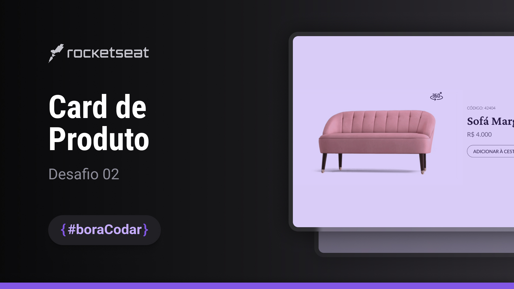</a></td>
        </tr>
        <tr>
            <td>03</td>
            <td><a href="03">Botões e Cursores</a></td>
            <td>25/01/23</td>
            <td align="center"><a href="03">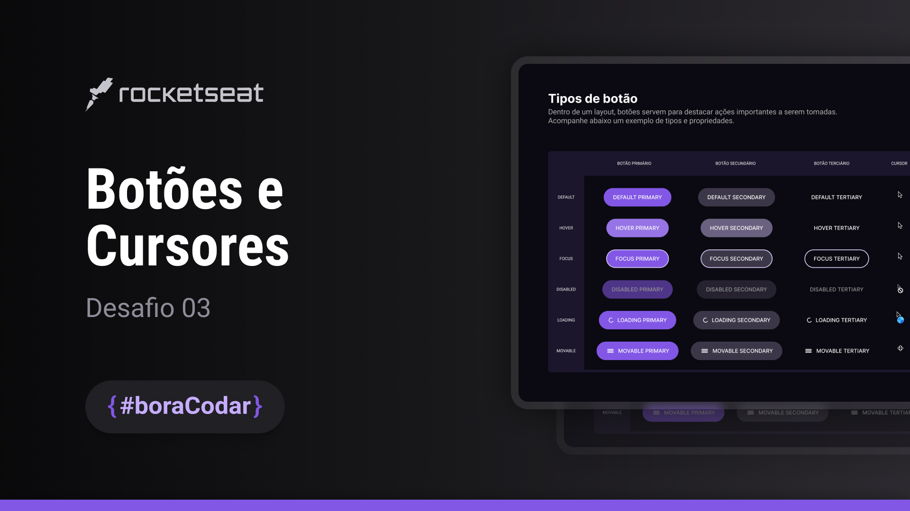</a></td>
        </tr>
        <tr>
            <td>04</td>
            <td><a href="04">Chat</a></td>
            <td>01/02/23</td>
            <td align="center"></td>
        </tr>
        <tr>
            <td>05</td>
            <td><a href="05">Calculadora</a></td>
            <td>08/02/23</td>
            <td align="center"><a href="05">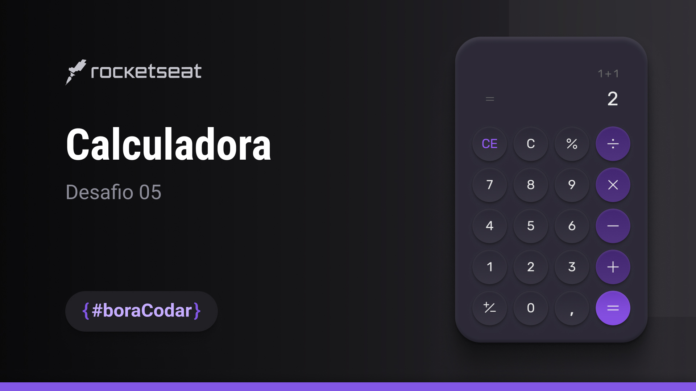</a></td>
        </tr>
        <tr>
            <td>06</td>
            <td><a href="06">Cartão de Embarque</a></td>
            <td>15/02/23</td>
            <td align="center" ><a href="06">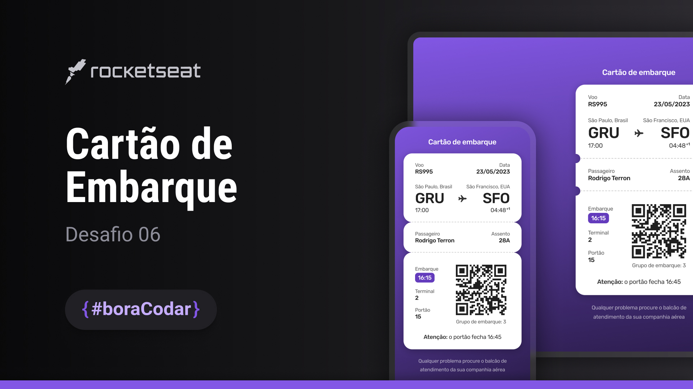</a></td>
        </tr>
        <tr>
            <td>07</td>
            <td><a href="07">Site de Carnaval</a></td>
            <td>22/02/23</td>
            <td align="center" ></td>
        </tr>
        <tr>
            <td>08</td>
            <td><a href="08">Dashboard</a></td>
            <td>01/03/23</td>
            <td align="center" ><a href="08">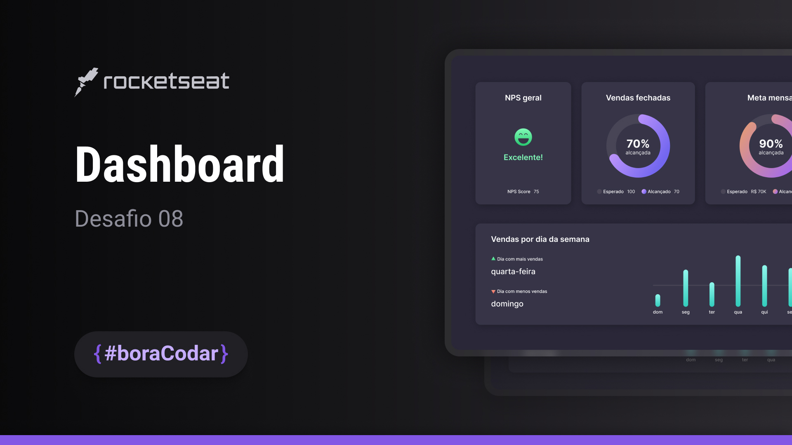</a></td>
        </tr>
        <tr>
            <td>09</td>
            <td><a href="09">Conversor de Moedas</a></td>
            <td>08/03/23</td>
            <td align="center" ><a href="09">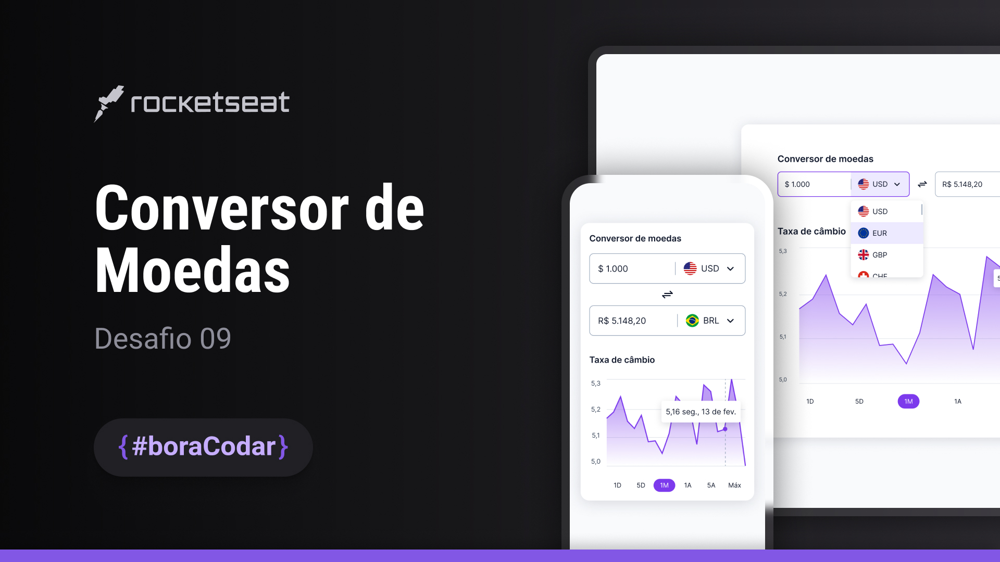</a></td>
        </tr>
        <tr>
            <td>10</td>
            <td><a href="10">Página de Clima</a></td>
            <td>15/03/23</td>
            <td align="center" ><a href="10">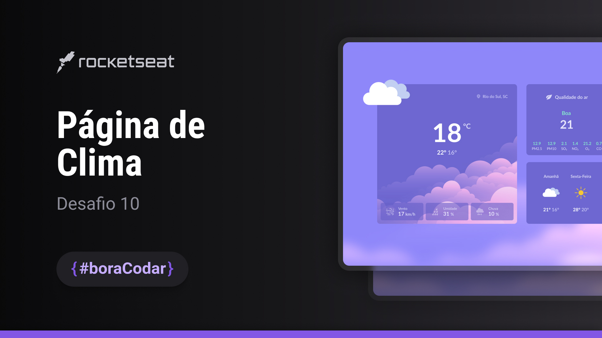</a></td>
        </tr>
        <tr>
            <td>11</td>
            <td><a href="11">Página de Login</a></td>
            <td>22/03/23</td>
            <td align="center" ></td>
        </tr>
        <tr>
            <td>12</td>
            <td><a href="12">Kanban</a></td>
            <td>29/03/23</td>
            <td align="center" ><a href="12">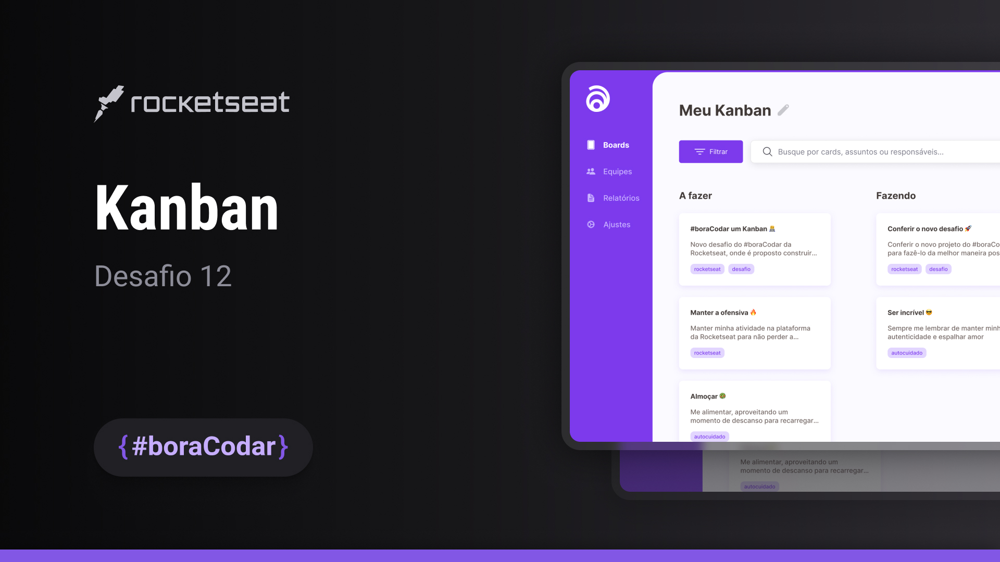</a></td>
        </tr>
        <tr>
            <td>13</td>
            <td><a href="13">Formulário de Cartão</a></td>
            <td>05/04/23</td>
            <td align="center" ><a href="13">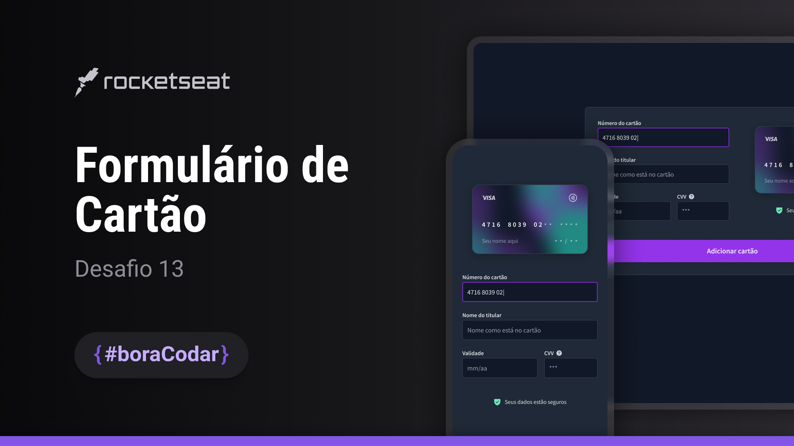</a></td>
        </tr>
        <tr>
            <td>14</td>
            <td><a href="14">Componente de Upload</a></td>
            <td>12/04/23</td>
            <td align="center" ><a href="14">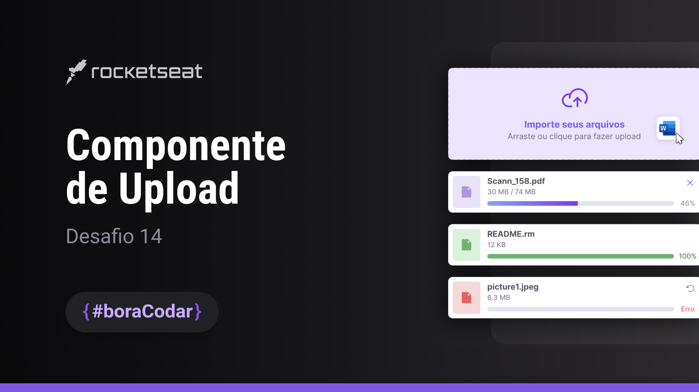</a></td>
        </tr>
        <tr>
            <td>15</td>
            <td><a href="15">Pricing Table</a></td>
            <td>19/04/23</td>
            <td align="center" ><a href="15">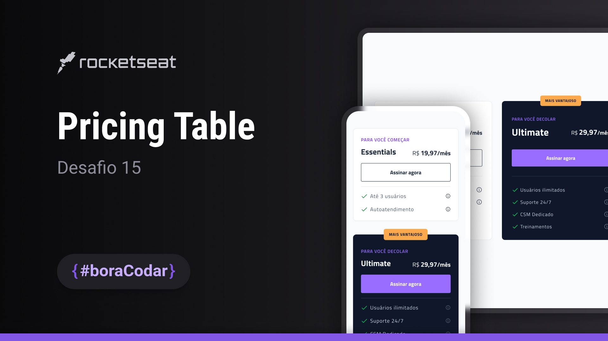</a></td>
        </tr>
        <tr>
            <td>16</td>
            <td><a href="16">Página de Contatos</a></td>
            <td>26/04/23</td>
            <td align="center" ><a href="16">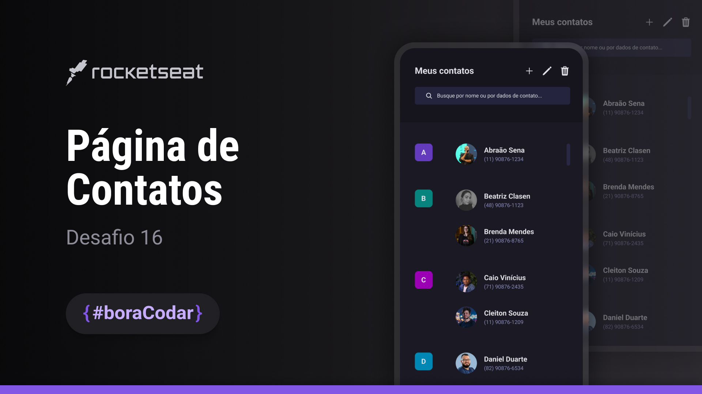</a></td>
        </tr>
        <tr>
            <td>17</td>
            <td><a href="17">Date Picker</a></td>
            <td>03/05/23</td>
            <td align="center" ><a href="17">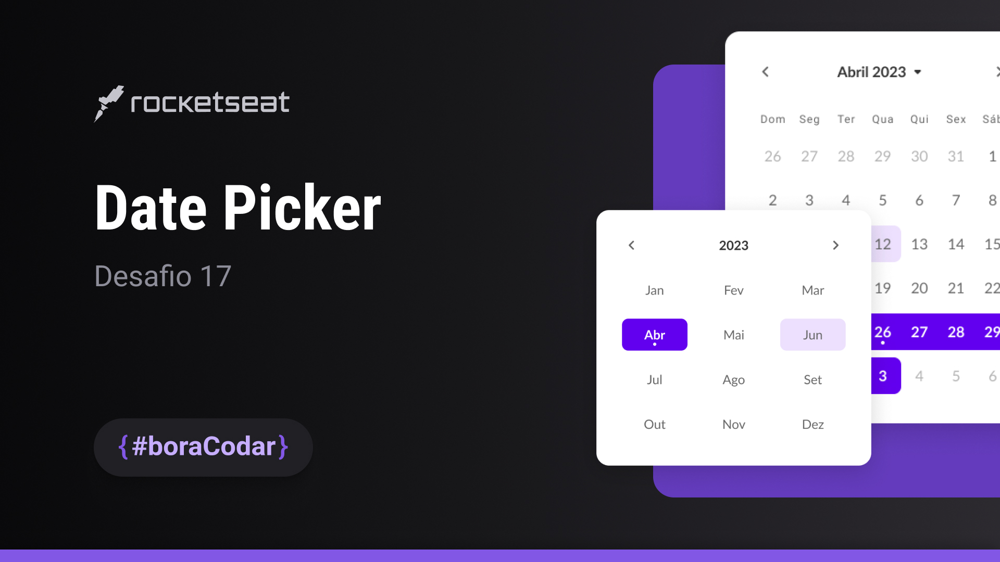</a></td>
        </tr>
        <tr>
            <td>18</td>
            <td><a href="18">Card de Personagem</a></td>
            <td>10/05/23</td>
            <td align="center" ><a href="18">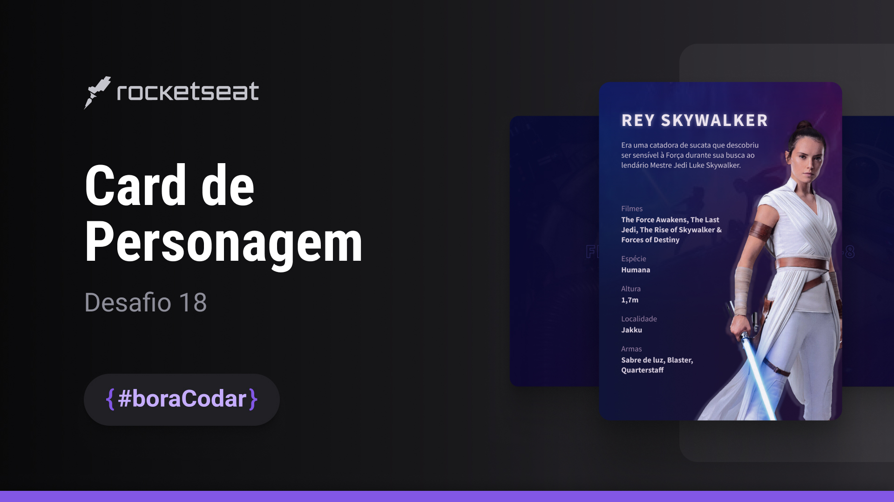</a></td>
        </tr>
        <tr>
            <td>19</td>
            <td><a href="19">Widget de Transporte</a></td>
            <td>15/05/23</td>
            <td align="center" ></td>
        </tr>
        <tr>
            <td>20</td>
            <td><a href="20">Galeria com Hover</a></td>
            <td>24/05/23</td>
            <td align="center" ><a href="20">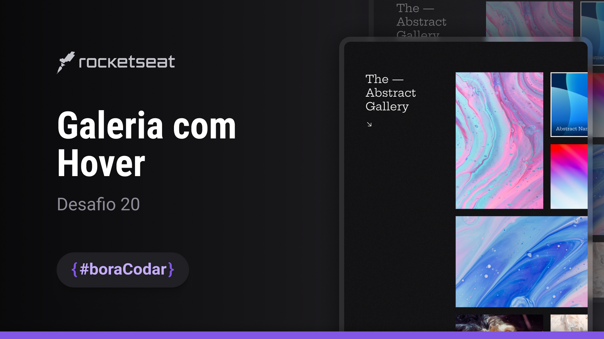</a></td>
        </tr>
        <tr>
            <td>21</td>
            <td><a href="21">Carrinho de Compras</a></td>
            <td>31/05/23</td>
            <td align="center" ><a href="21">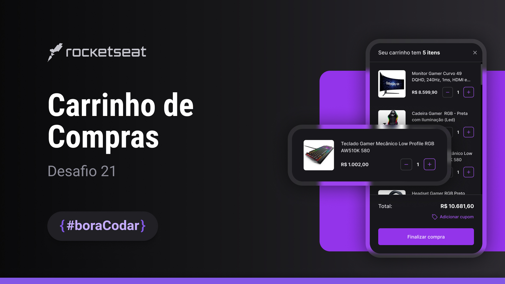</a></td>
        </tr>
        <tr>
            <td>22</td>
            <td><a href="22">Profile Settings</a></td>
            <td>07/06/23</td>
            <td align="center" ><a href="22">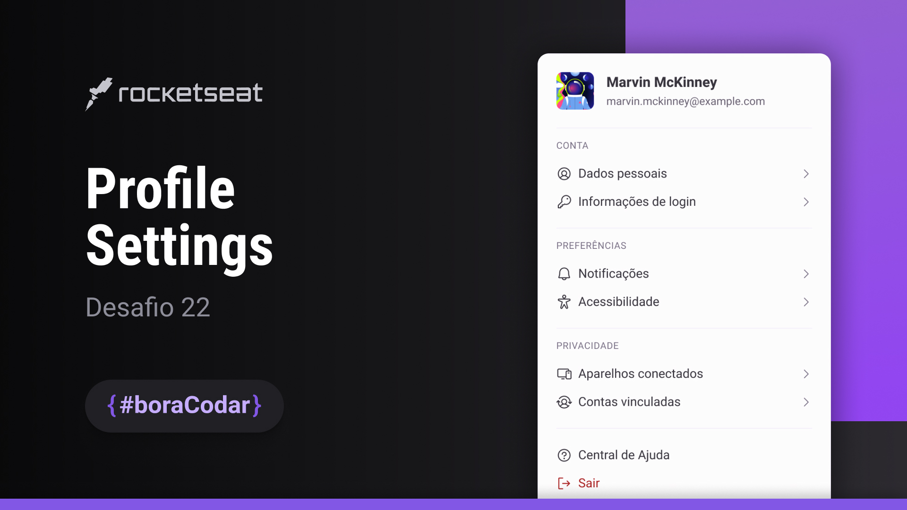</a></td>
        </tr>
        <tr>
            <td>23</td>
            <td><a href="23">Formulário Multi Step</a></td>
            <td>14/06/23</td>
            <td align="center" ></td>
        </tr>
        <tr>
            <td>24</td>
            <td><a href="24">Ajustes de Iluminação</a></td>
            <td>21/06/23</td>
            <td align="center" ></td>
        </tr>
        <tr>
            <td>25</td>
            <td><a href="25">Player de VR</a></td>
            <td>10/07/23</td>
            <td align="center" ></td>
        </tr>
        <tr>
            <td>26</td>
            <td><a href="26">Receita junina</a></td>
            <td>10/07/23</td>
            <td align="center" ><a href="26">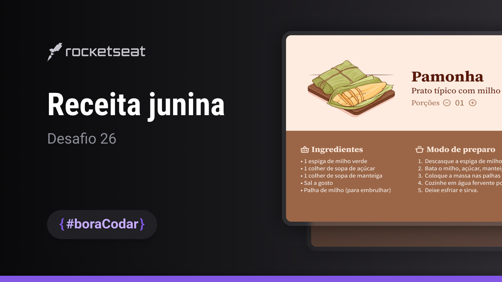</a></td>
        </tr>
        <tr>
            <td>27</td>
            <td><a href="27">Página 404</a></td>
            <td>12/07/23</td>
            <td align="center" ><a href="27">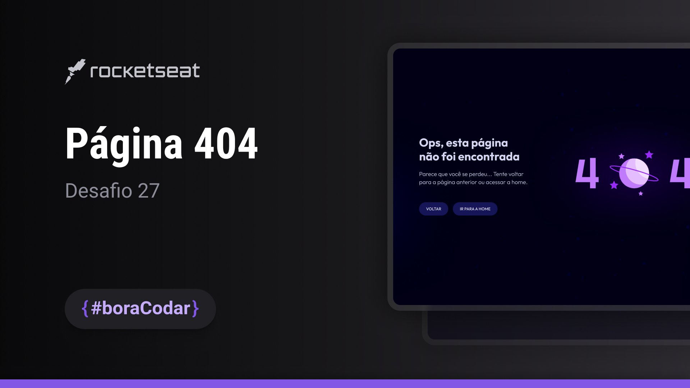</a></td>
        </tr>
          <tr>
            <td>28</td>
            <td><a href="28">Plataforma de IA</a></td>
            <td>19/07/23</td>
            <td align="center" ><a href="28">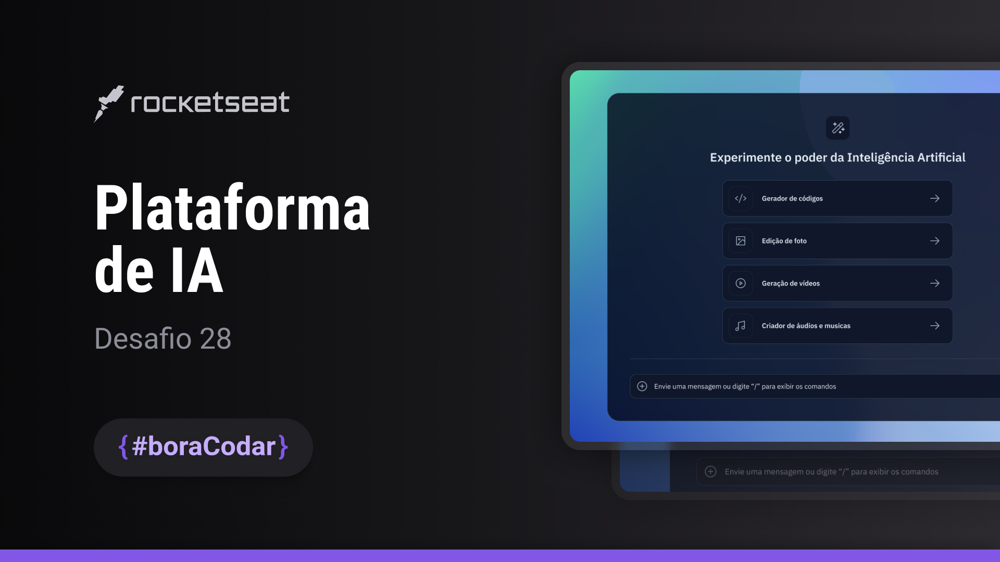</a></td>
        </tr>
        <tr>
            <td>29</td>
            <td><a href="29">Antes e depois com IA</a></td>
            <td>26/07/23</td>
            <td align="center" ></td>
        </tr>
        <tr>
            <td>30</td>
            <td><a href="30">Recomendação de Filme (IA)</a></td>
            <td>04/08/23</td>
            <td align="center" ></td>
        </tr>
    </tbody>
</table>

